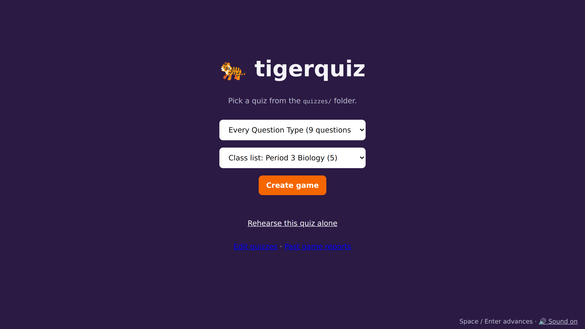
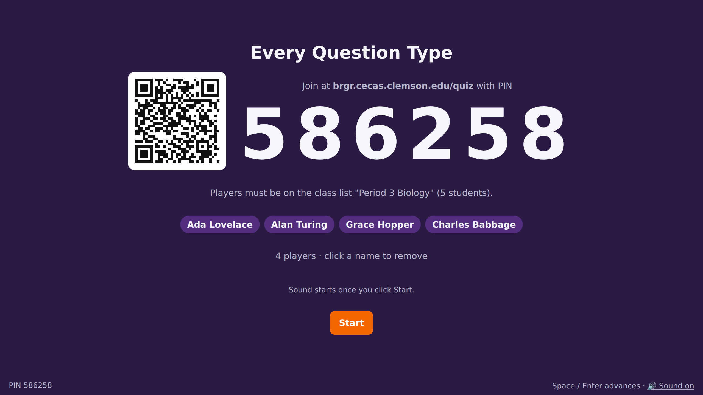
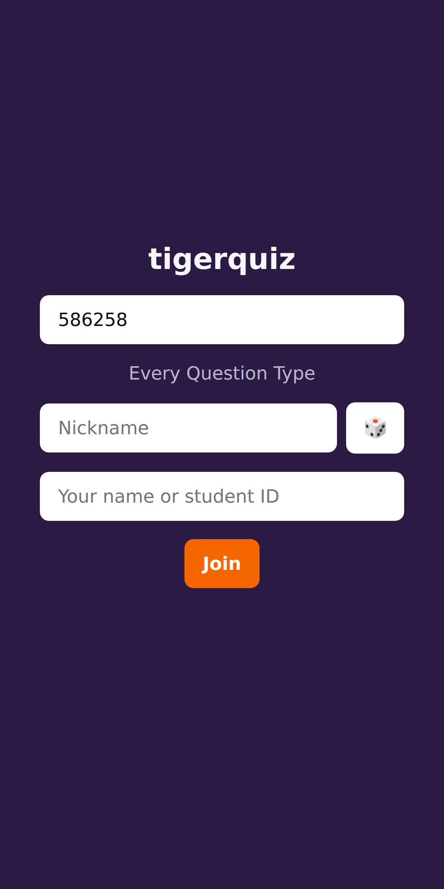
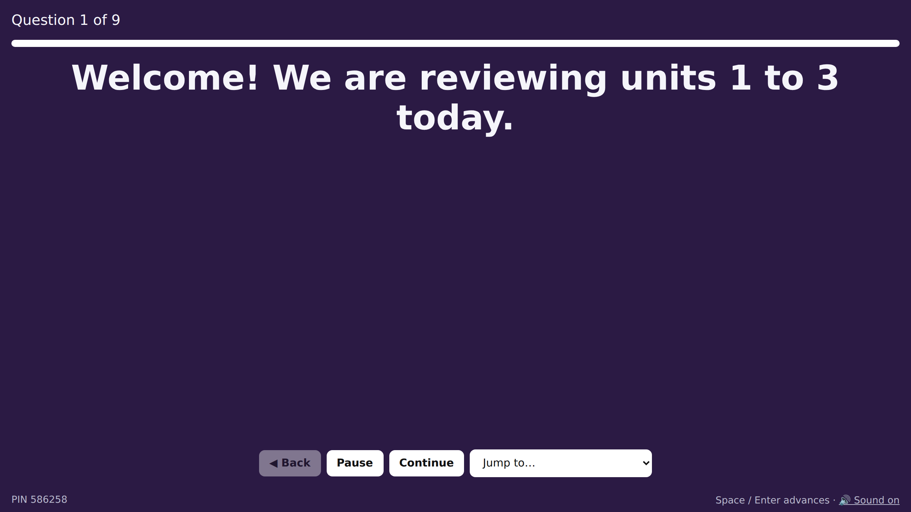
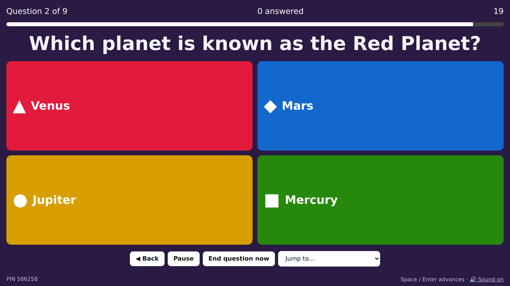
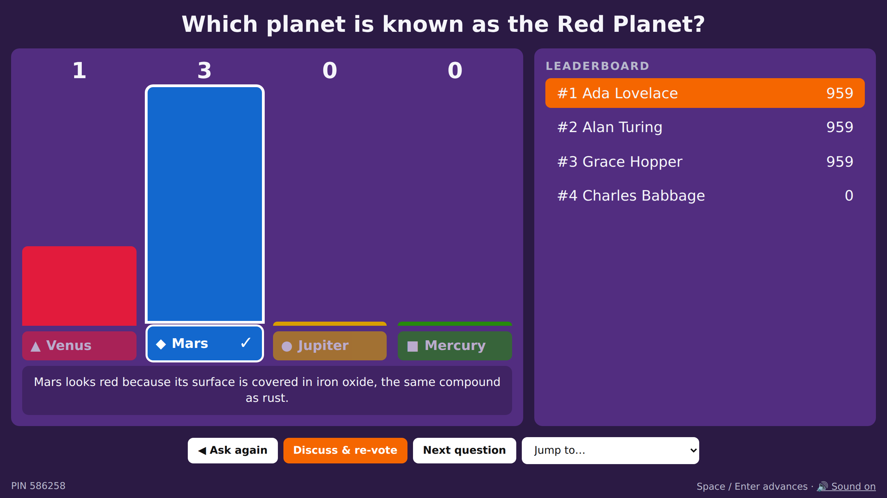
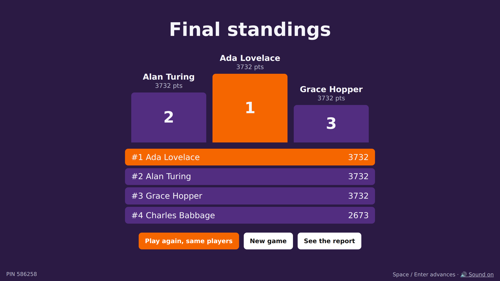
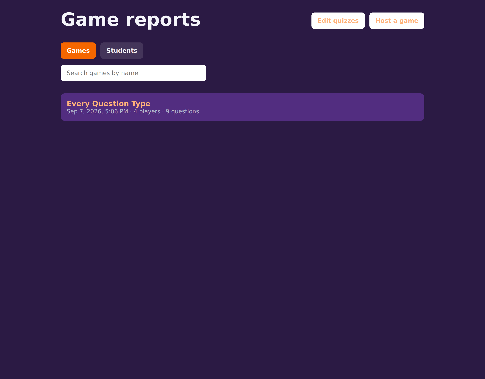
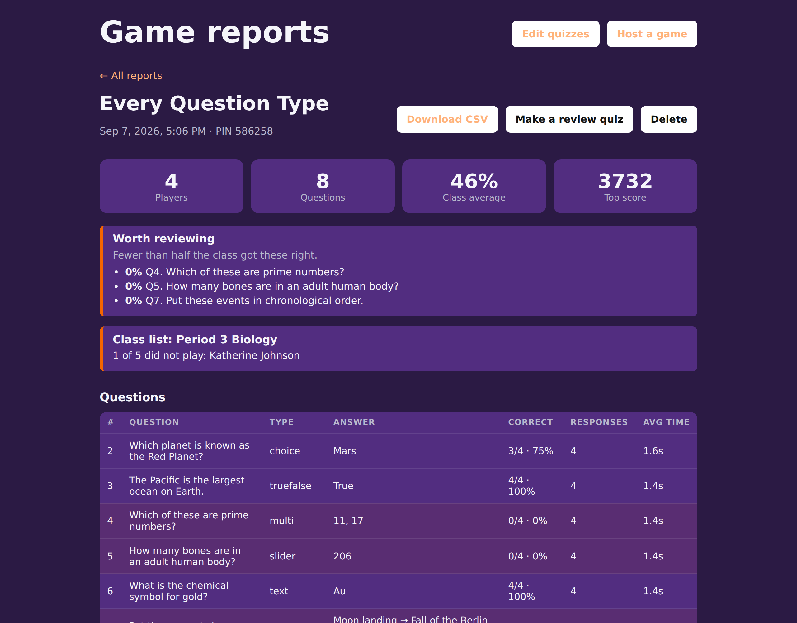
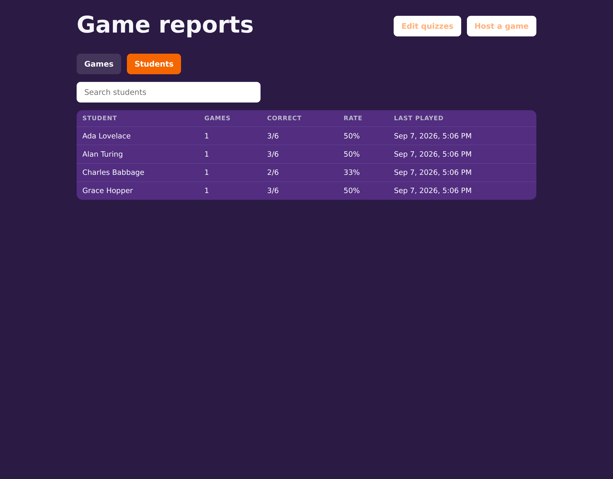

# Running a lesson with tigerquiz

A walkthrough of one game from start to finish, for the person standing at the
front of the room. It assumes somebody has already installed tigerquiz and told
you the address; if that is still to do, see the [README](../README.md).

Every screenshot here is a real game, played with the `all-types` demo quiz and
the `period3` demo class list that ship with the project.

## Before the lesson

Two things are worth doing while nobody is watching.

**Check the quiz.** `npm run check` reads every quiz and class list and reports
anything that would break mid-lesson — a wrong answer index, a missing image, a
question with no explanation. It is quick and it is much better to find these
now.

**Rehearse it.** The setup screen has a "Rehearse this quiz alone" option that
plays the whole quiz with no players, so you can read every question on the
projector before a class sees it. Rehearsals produce no report.

## 1. Start a game

Open the host screen. Pick the quiz, and optionally a class list.

Pick the class list when you want the report to name people rather than
nicknames. Students then have to identify themselves as somebody on it, and the
report tells you who never played.

> **Open the host screen by network name, not `localhost`.** The PIN and QR code
> students see are built from whatever address is in your browser bar, so a
> `localhost` address hands them a link they cannot reach. The lobby warns you
> when it spots this.

## 2. The lobby

Students can scan the QR code or type the address and PIN. Names appear as
people arrive, and clicking a name removes that person — useful when somebody
picks a nickname you would rather not project.

This is what a student sees on their phone. Scanning the QR fills the PIN in for
them:

The second box appears because this quiz asks for a student ID. With a class
list in play, what they type has to match somebody on it — by name or by ID,
ignoring case, spacing and punctuation.

Press **Start** when the room has settled. Sound needs a click before a browser
will play it, so pressing Start is also what unlocks the sound effects.

## 3. Work through the questions

A quiz can open with a slide, which is just something on the screen with nothing
to answer. Press space to move past it.

Then the questions themselves. The bar across the top is the clock, and the
counter tells you how many people have answered — which is the number to watch,
because it tells you when the room is ready to move on rather than when the
timer happens to run out.

| Control | What it does |
| --- | --- |
| **Space** or **Enter** | Advance |
| **←** / **→** | Move between questions |
| **P** or **Pause** | Stop the clock for everyone and refuse answers. Paused time is not counted against anyone's speed |
| **End question now** | Stop waiting for the stragglers |
| **Back** | Replay the previous question, rewinding every score and streak so nobody is paid twice |
| **Jump to…** | Go straight to any question |

## 4. Read the results together

Three things on this screen are worth your attention.

**The explanation** appears under the answers the moment it is revealed, on the
projector and on every phone. This is what turns a wrong answer into something
learned, while the student still cares about it.

**The distribution** shows what people actually chose. One person here picked
Venus. A low correct rate tells you a question was hard; the wrong answer people
landed on tells you what they believe instead, which is the more useful fact.

**Discuss & re-vote** lights up when the class was split. It re-asks the same
question so students can argue it out with each other first. Scores come from
the second vote only, so discussing cannot inflate anyone's total, and the
results afterwards show both rounds side by side with a line reading how many
were right before and after.

## 5. Finish

Third, second and first are revealed in turn. From here you can play the same
quiz again with everyone still in the room, or go straight to the report.

## 6. Afterwards: the report

Every finished game is saved. Games you abandon before the final standings are
not.

The report leads with what you would want to know walking out of the room: the
class average, and the questions fewer than half the class got right. With a
class list, it names anyone who never played — Katherine Johnson, above.

Below that, every question is broken down by correct rate, number of responses
and average response time. **Download CSV** gives one row per player per
question for a gradebook or a spreadsheet.

**Make a review quiz** writes a new quiz from the questions this class did worst
on, ordered worst first, keeping the explanations. It appears in your quiz list,
so the next lesson can open with exactly what was missed.

## Following people across lessons

The **Students** tab collects the same person across every game they have
played. People are keyed on what identifies them rather than on the nickname
they happened to pick that day: the identifier when the quiz asks for one, which
with a class list resolves to their name on the list, and the nickname only when
there is nothing better. It is the view to open when you want to know how one
student is doing over a term rather than how one lesson went.

## When something goes wrong

**A student cannot join.** Check they are using the address on the lobby screen,
not `localhost`. With a class list, check the name or ID they typed is on it.
Once a game has started, nobody new can join.

**A student's phone dropped out.** They rejoin with the same nickname and pick
up where they left off, with their score intact.

**Your browser crashed or you closed the tab.** The game is paused and held open
for three minutes, and students are told you are away. Reopen the host page and
it rejoins the same game automatically, back where it was.

**The server restarted.** Games in progress are gone; live game state is only
ever held in memory. Finished reports are safe on disk.

**A nickname you would rather not project.** Click the name in the lobby to
remove that person. Nicknames are screened against a word list first, including
disguises like `sh1t`, but no list is complete. You can add your own words, one
per line, in `quizzes/blocked-words.txt`.
